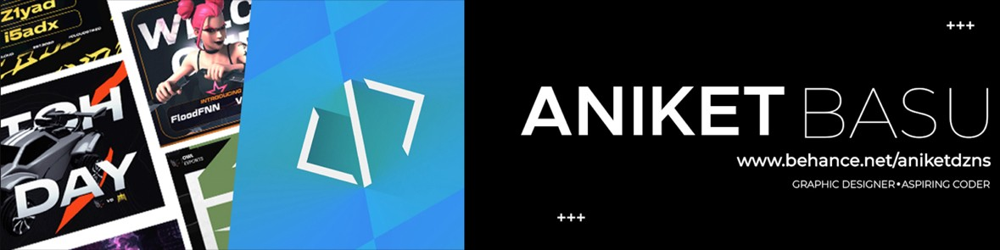

# 🚀 Aniket Basu Portfolio


A modern and responsive portfolio website showcasing my work, skills, projects, and design journey as a UI/UX Designer, Graphic Designer, and Full-Stack Developer.

## 🌐 Live Demo

[View Portfolio](https://your-vercel-url.vercel.app)

## ✨ Features

- Responsive and modern UI
- Project showcase section
- Skills & tools overview
- Resume download
- Contact section
- Fast performance with Next.js
- Clean and accessible design

## 🛠️ Tech Stack

### Frontend
- Next.js
- React
- TypeScript
- Tailwind CSS

### UI Components
- shadcn/ui
- Radix UI

### Design Tools
- Figma
- Adobe Photoshop
- Adobe Illustrator

## 📂 Project Structure

```bash
├── app/
├── components/
├── hooks/
├── lib/
├── public/
├── styles/
└── README.md
```

## 🚀 Getting Started

Clone the repository:

```bash
git clone https://github.com/Ani7772/My-Portfolio.git
```

Navigate to the project folder:

```bash
cd My-Portfolio
```

Install dependencies:

```bash
npm install
```

Run the development server:

```bash
npm run dev
```

Open:

```bash
http://localhost:3000
```

## 👨‍💻 About Me

I'm Aniket Basu, a B.Tech CSE (UI/UX) student at Bennett University passionate about creating intuitive digital experiences through UI/UX design, graphic design, full-stack development, and emerging AI technologies.

### Interests

- UI/UX Design
- Graphic Design
- Full-Stack Development
- Agentic AI
- Product Design
- Frontend Development

## 📫 Connect With Me

- LinkedIn: [https://www.linkedin.com/in/your-linkedin](https://www.linkedin.com/in/aniket-basu-6a5896298/)
- Behance: [https://www.behance.net/your-behance](https://www.behance.net/aniketdzns)
- GitHub: https://github.com/Ani7772

## 📄 License

This project is open source and available under the MIT License.
